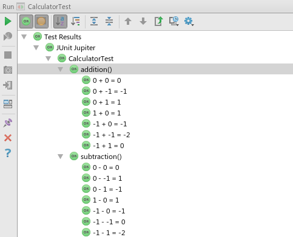

Sometimes there are a lot of relevant cases to be tested for a single method.
In these instances it is rather tedious to implement an unique test method for each relevant case.
JUnit 5 can help you with the introduction of dynamic tests.

### The Class Under Test

For starters, let's define a simple class to be tested: `Calculator`
This class offers two methods:

1. adding two integers
2. subtracting two integers

```java
public class Calculator {

    public int add(int a, int b){
        return a + b;
    }

    public int subtract(int a, int b){
        return a - b;
    }

}
```

### The Rules

Next we define a set of rules in two separate files: `addition-rules.txt` and `subtraction-rules.txt`
These will provide the input for our dynamic tests.

**addition-rules.txt**
```
 0, 0 | 0
 0, 1 | 1
 1, 0 | 1
-1, 0 |-1
 0,-1 |-1
-1, 1 | 0
-1,-1 |-2
```

**subtraction-rules.txt**
```
 0, 0 | 0
 0, 1 |-1
 1, 0 | 1
-1, 0 |-1
 0,-1 | 1
-1, 1 |-2
-1,-1 | 0
```

Both files use the same format: Two input variables and an expected result.

### The Tests

Finally we write our tests. The rule files are parsed by a separate class `DataSet`.

```java
public class CalculatorTest {

    Calculator cut = new Calculator();

    @TestFactory
    Stream<DynamicTest> addition() {
        return DataSet.parseRuleFile("addition-rules.txt")
            .map(dataSet -> dynamicTest(getAdditionDisplayName(dataSet), () -> {
                int result = cut.add(dataSet.getValueA(), dataSet.getValueB());
                assertThat(result).isEqualTo(dataSet.getExpectedResult());
            }));
    }

    String getAdditionDisplayName(DataSet dataSet) {
        return dataSet.getValueA() + " + " + dataSet.getValueB() + " = " + dataSet.getExpectedResult();
    }

    @TestFactory
    Stream<DynamicTest> subtraction() {
        return DataSet.parseRuleFile("subtraction-rules.txt")
            .map(dataSet -> dynamicTest(getSubtractionDisplayName(dataSet), () -> {
                int result = cut.subtract(dataSet.getValueA(), dataSet.getValueB());
                assertThat(result).isEqualTo(dataSet.getExpectedResult());
            }));
    }

    String getSubtractionDisplayName(DataSet dataSet) {
        return dataSet.getValueA() + " - " + dataSet.getValueB() + " = " + dataSet.getExpectedResult();
    }

}
```

### The Result

When we execute the test class within IntelliJ, we get the following result:



As you can see, JUnit generated tests using our test factories based on the input from the rule files.
This example is of course rather simple. But I think it still shows what kinds of tests are possible with JUnit 5.